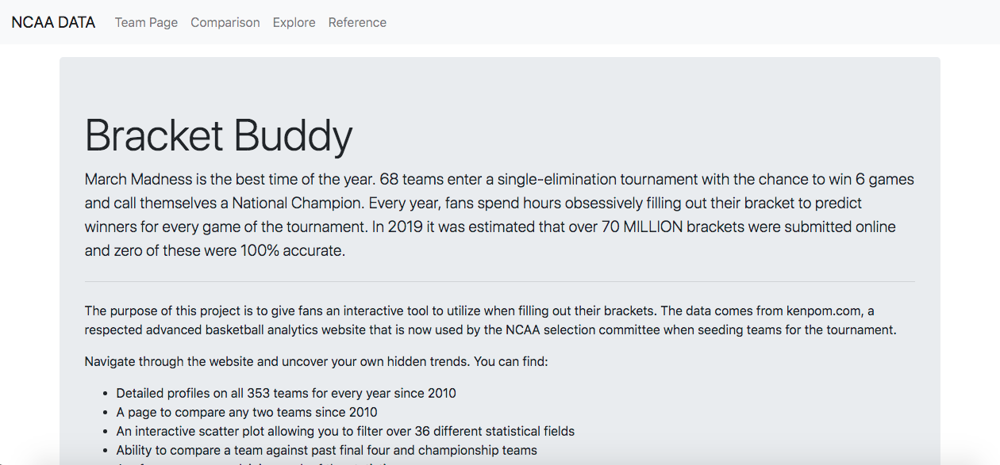
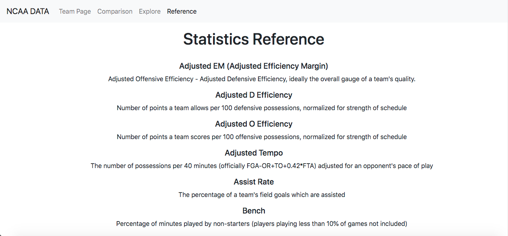

# Bracket Buddy

March Madness is the best time of the year. 68 teams enter a single-elimination tournament with the chance to win 6 games and call themselves a National Champion. Every year, fans spend hours obsessively filling out their bracket to predict winners for every game of the tournament. In 2019 it was estimated that over 70 MILLION brackets were submitted online and zero of these were 100% accurate.

The purpose of this project is to give fans an interactive tool to utilize when filling out their brackets. The data comes from kenpom.com, a respected advanced basketball analytics website that is now used by the NCAA selection committee when seeding teams for the tournament.

Navigate through the website and uncover your own hidden trends. You can find:

Detailed profiles on all 353 teams for every year since 2010
A page to compare any two teams since 2010
An interactive scatter plot allowing you to filter over 36 different statistical fields
Ability to compare a team against past final four and championship teams
A reference page explaining each of the statistics

## Pages
### Home Page

### Team Page

### Comparison Page

### Explore Page

### Reference Page

## Technology Used
* HTML/CSS
* Bootstrap (V4)
* Pandas
* Scipy
* Numpy
* Flask
* MongoDB
* ChartJS
* D3.js

